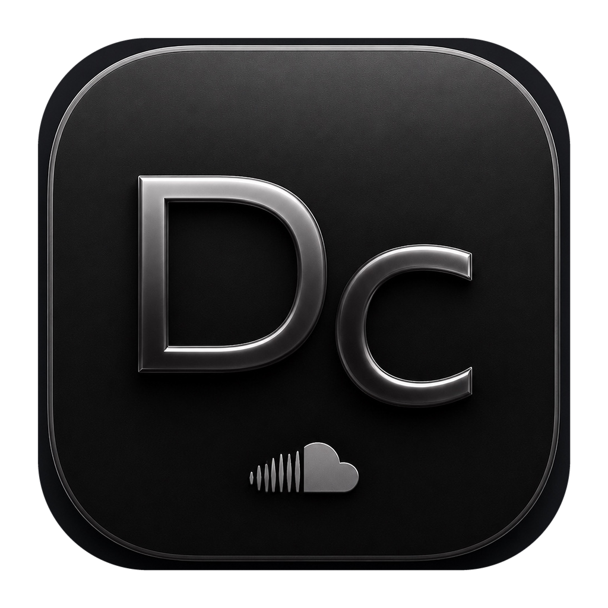

<div align="center">
  

# DieCloude

### Нативный SoundCloud-клиент для macOS

**Текущая версия: 3.5.0 (сборка 18)**

[](https://github.com/siemens33/DieCloud-MacOS/releases/latest)
[](https://github.com/siemens33/DieCloud-MacOS/releases/latest)
[](https://github.com/siemens33/DieCloud-MacOS/actions/workflows/release.yml)
[](THIRD_PARTY_NOTICES.md)

[**Скачать DieCloude.dmg**](https://github.com/siemens33/DieCloud-MacOS/releases/latest/download/DieCloude.dmg)

</div>

---


## Исправление интерфейса 3.5.0 (сборка 18)

- Исправлена несовместимость визуальных эффектов с тёмной темой SoundCloud.
- Ambient Background больше не перекрывает интерфейс.
- Стеклянные панели применяются только к безопасным областям.
- Убраны слишком широкие CSS-селекторы, ломавшие карточки, изображения и панели.
- Экспериментальные эффекты теперь выключены по умолчанию и включаются вручную через F1.
- Добавлена одноразовая миграция настроек для пользователей предыдущей сборки 3.5.0.

## Что нового в версии 3.5.0

- Добавлена отдельная система оформления DieCloude поверх интерфейса SoundCloud.
- Каждый визуальный эффект можно независимо включать и выключать в настройках по клавише **F1**.
- Добавлены современный тёмный дизайн, стеклянные панели и скруглённые карточки.
- Добавлены hover-анимации, плавные переходы страниц и подсветка кнопок воспроизведения.
- Добавлены вращение обложки, волна около Play и настраиваемый визуализатор.
- Добавлены компактный режим, плавная прокрутка и режим сниженной анимации.
- Настройки сохраняются между запусками приложения.
- Скрипт публикации теперь автоматически обновляет README и историю изменений для каждого релиза.

## О приложении

**DieCloude** — лёгкий клиент SoundCloud для macOS, написанный на Swift с использованием AppKit и WebKit. Приложение сохраняет привычный интерфейс SoundCloud и добавляет функции, ориентированные на удобное прослушивание на Mac.

## Возможности

| Функция | Что делает |
|---|---|
| **Нативное окно macOS** | SoundCloud запускается как отдельное приложение, а не вкладка браузера |
| **Режим без рекламы** | Снижает количество рекламных и отвлекающих элементов внутри клиента |
| **Focus Mode** | Оставляет на экране главное и упрощает интерфейс во время прослушивания |
| **Dynamic Theme** | Адаптирует оформление приложения |
| **Ambient Background** | Создаёт фоновый визуальный эффект, связанный с воспроизведением |
| **Визуализатор** | Добавляет визуальное сопровождение музыки |
| **Современный дизайн** | Применяет фирменное тёмное оформление DieCloude поверх SoundCloud |
| **Стеклянные панели** | Добавляет полупрозрачность и размытие элементов интерфейса |
| **Скруглённые карточки** | Оформляет треки, плейлисты и блоки как современные карточки |
| **Hover-анимации** | Плавно выделяет карточки и кнопки при наведении |
| **Переходы страниц** | Добавляет мягкое появление содержимого при навигации |
| **Свечение Play** | Подсвечивает кнопки воспроизведения акцентным цветом |
| **Вращение обложки** | Опционально вращает текущую обложку во время воспроизведения |
| **Волна Play** | Показывает лёгкую пульсацию вокруг кнопки воспроизведения |
| **Компактный режим** | Уменьшает отступы и размеры элементов для более плотного списка |
| **Сниженная анимация** | Отключает тяжёлые переходы и учитывает системную настройку Reduce Motion |
| **VPN только для DieCloude** | Направляет через прокси только трафик встроенного SoundCloud, не затрагивая другие приложения |
| **Happ-совместимые подписки** | Загружает список серверов из поддерживаемой ссылки подписки |
| **Проверка пинга** | Помогает выбрать сервер с меньшей задержкой |
| **Автоподключение VPN** | Подключает последний выбранный сервер при запуске приложения |
| **Keychain** | Хранит ссылку VPN-подписки в системной связке ключей macOS |
| **Автообновление** | Проверяет новые версии через GitHub Releases и открывает свежий DMG |
| **Universal Binary** | Поддерживает Apple Silicon и Intel Mac |

> Отдельный прокси для WKWebView требует macOS 14 или новее. Основные функции приложения рассчитаны на macOS 12+.

## Установка

1. Нажми **«Скачать DieCloude.dmg»** выше.
2. Открой скачанный DMG.
3. Перетащи `DieCloude.app` в папку **«Программы»**.
4. Для неподписанной тестовой сборки один раз запусти находящийся в DMG файл **«Первый запуск DieCloude.command»**.
5. После подготовки приложение откроется автоматически.

### Почему может потребоваться файл первого запуска

Текущие публичные сборки используют локальную ad-hoc подпись и пока не нотариализованы Apple. Для установки обычным двойным нажатием без дополнительных действий необходимы сертификат **Developer ID Application** и нотариализация.


## Настройка дизайна и анимаций

Нажми **F1** или кнопку с ползунками в верхней панели. В боковом окне можно независимо включать и выключать:

- современный дизайн;
- стеклянные панели;
- скруглённые карточки;
- динамическую тему и фон из обложки;
- hover-анимации и переходы страниц;
- свечение, вращение обложки, волну Play и визуализатор;
- компактный режим и плавную прокрутку;
- режим сниженной анимации;
- Focus Mode и режим без рекламы.

Все значения сохраняются в `UserDefaults` и восстанавливаются при следующем запуске. Эффекты применяются только внутри DieCloude и не изменяют сайт SoundCloud в других браузерах.

## VPN

1. Открой окно VPN в DieCloude.
2. Вставь совместимую ссылку подписки.
3. Обнови список серверов.
4. Проверь пинг и выбери сервер.
5. Нажми подключение.
6. При необходимости включи **«Автоподключение при запуске DieCloude»**.

VPN-режим предназначен только для трафика DieCloude и не является системным VPN для всего Mac.

## Обновления

DieCloude обращается к публичным GitHub Releases репозитория `siemens33/DieCloud-MacOS`. Когда опубликована более новая версия, приложение предлагает скачать DMG и открывает его для установки.

## Сборка из исходников

Требования:

- macOS;
- Xcode Command Line Tools;
- подключение к интернету для загрузки Xray-core.

Запусти:

```bash
chmod +x "Создать установщик.command"
./"Создать установщик.command"
```

Готовый DMG появится в папке `build`.

## Публикация новой версии

Для автоматической публикации запусти:

```bash
./"Опубликовать обновление.command"
```

Скрипт:

1. запросит новый номер версии и описание;
2. синхронно обновит версию приложения и номер сборки;
3. создаст commit;
4. отправит ветку `main`;
5. создаст и отправит тег `vX.Y.Z`;
6. запустит GitHub Actions;
7. GitHub соберёт и прикрепит `DieCloude.dmg` к Release.

## Важное замечание

DieCloude не является официальным приложением SoundCloud и не связан с SoundCloud. Названия и товарные знаки принадлежат их владельцам. Сведения о сторонних компонентах находятся в [`THIRD_PARTY_NOTICES.md`](THIRD_PARTY_NOTICES.md).
